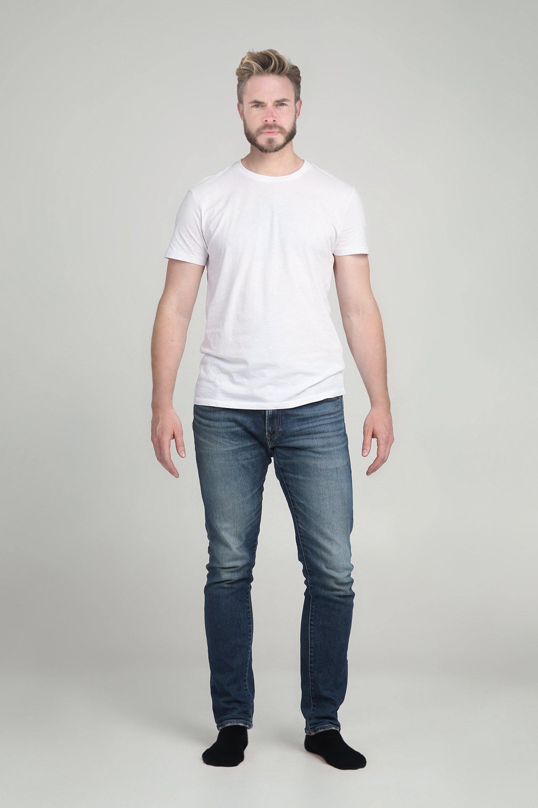
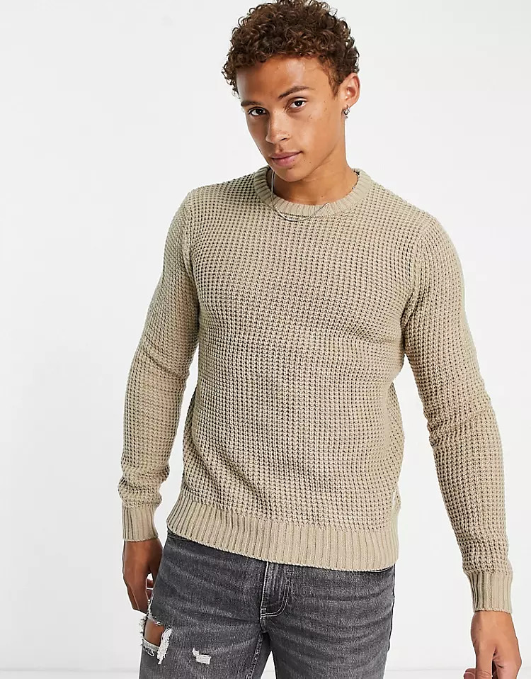
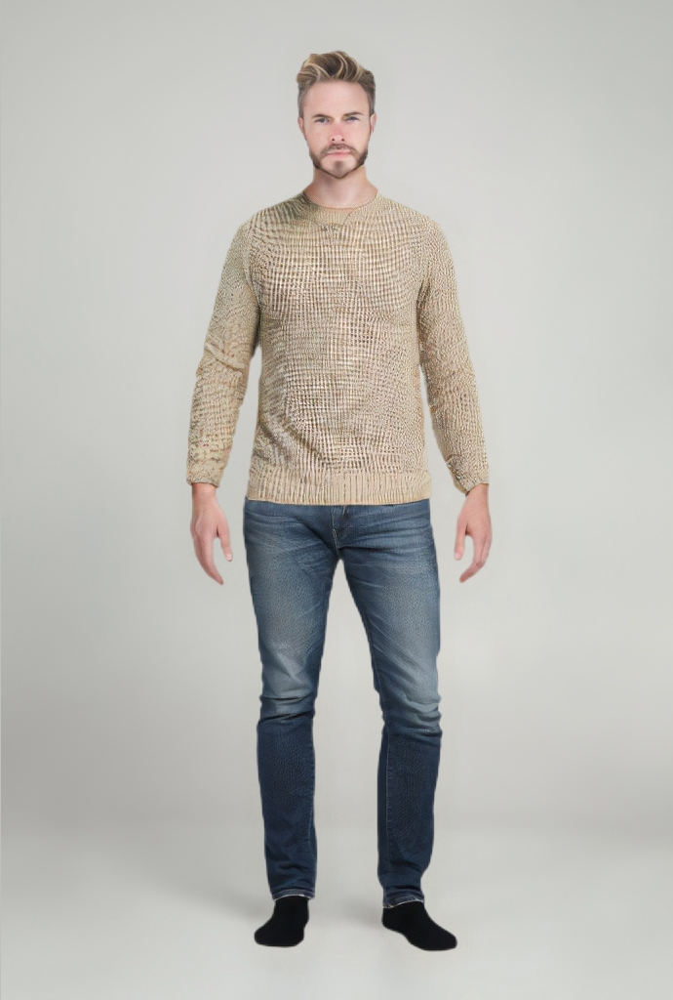

# Virtual Dressing Room Python Example

Welcome to the Virtual Dressing Room Example project! This repository demonstrates the usage of a [Texel.Moda](https://texelmoda.com/) virtual dressing room system that allows users to try on different outfits using images of clothing items and avatars. The project utilizes the RapidAPI platform to make the virtual try-on process seamless.

## Prerequisites

Before you begin, make sure you have the following prerequisites:

- RapidAPI Account: To access the virtual dressing room API, you need a RapidAPI account. Visit [RapidAPI website](https://rapidapi.com/texel-inc-texel-inc-default/api/texel-virtual-try-on) to sign up and obtain an API key.

## Installation

1. Clone this repository to your local machine:

```
git clone https://github.com/TexelModa/virtual-try-on-python.git
```

2. Navigate to the project directory:

```
cd virtual-try-on-python
```

3. Install any necessary dependencies:

```
pip install -r requirements.txt
```

## Usage

1. Obtain your RapidAPI key by signing up on the [RapidAPI website](https://rapidapi.com/texel-inc-texel-inc-default/api/texel-virtual-try-on).

2. Open the `src/config.py` file and replace `'RAPID_API_KEY'` with your actual RapidAPI key.

3. Prepare the clothing item image and avatar image that you want to use for the virtual try-on. Make sure the images are in a compatible format (e.g., JPG, PNG).

4. Run the virtual dressing room script:

```
python src/main.py
```

5. The script will generate an output image (`result.jpg`) showing the avatar wearing the chosen clothing item.

## Demo

Here are the example images used in the demo:

Avatar Image (original, e.g., it can be your photo): 



Look Image (clothes you want to try on in your photo):



Result Image: 



## Contributing

Contributions are welcome! If you find any issues or want to add improvements to the project, feel free to submit a pull request.

## License

This project is licensed under the MIT License. See the LICENSE file for details.

---

Happy virtual dressing! If you have any questions or need assistance, feel free to open an issue or contact us.
